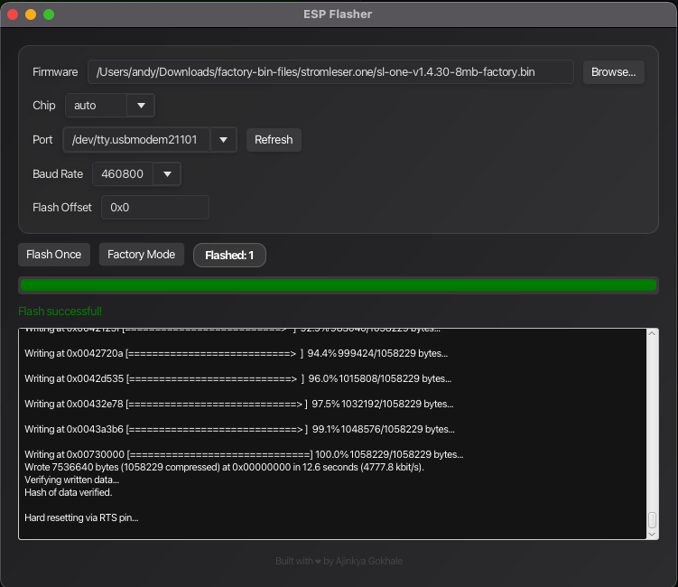
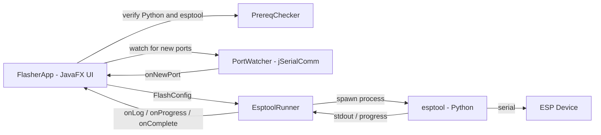

# ESP Flasher — Cross-Platform GUI Firmware Flashing Tool for ESP32 and ESP8266

**ESP Flasher** is a free, open-source desktop application for flashing firmware to Espressif **ESP32**, **ESP32-S2/S3/C3/C6/H2**, and **ESP8266** microcontrollers. It provides a clean JavaFX graphical interface on top of the official [`esptool`](https://github.com/espressif/esptool) — a modern alternative to **Tasmotizer**, the **Tasmota Web Installer**, and **ESP Flash Download Tool** that runs natively on macOS and Windows.

If you have ever fought with the `esptool.py` command line, hunted for the right baud rate, or needed to flash the same firmware onto dozens of boards on a production line, ESP Flasher is built for you.

---

## Table of Contents

- [Why ESP Flasher](#why-esp-flasher)
- [Features](#features)
- [Supported Espressif Chips](#supported-espressif-chips)
- [ESP Flasher vs Tasmotizer vs ESP Flash Download Tool](#esp-flasher-vs-tasmotizer-vs-esp-flash-download-tool)
- [Screenshots](#screenshots)
- [Download and Installation](#download-and-installation)
- [Prerequisites](#prerequisites)
- [How to Flash an ESP32 — Step by Step](#how-to-flash-an-esp32--step-by-step)
- [Factory Mode for Mass Flashing](#factory-mode-for-mass-flashing)
- [How It Works](#how-it-works)
- [Building From Source](#building-from-source)
- [Releases](#releases)
- [Troubleshooting](#troubleshooting)
- [FAQ](#faq)
- [Contributing](#contributing)
- [License](#license)
- [Credits](#credits)

---

## Why ESP Flasher

Most ESP32 / ESP8266 firmware flashing tools fall into one of three buckets:

- **Command-line `esptool`** — powerful but unforgiving, with no progress UI and no port auto-detection.
- **Browser-based flashers** (Tasmota Web Installer, ESP Web Tools) — convenient, but tied to Chrome's Web Serial API and not suitable for offline or production environments.
- **Vendor GUIs** (Espressif Flash Download Tool, Tasmotizer) — Windows-first, Python-heavy, and not designed for repeated batch flashing.

ESP Flasher fills the gap: a small, native, cross-platform GUI that drives the same battle-tested `esptool` underneath, with a dedicated **Factory Mode** for flashing many boards in sequence.

---

## Features

- Native installers for **macOS** (`.dmg`) and **Windows** (`.msi`) — no Python GUI required to launch
- Automatic detection of ESP32 and ESP8266 serial ports (CP210x, CH340, FTDI)
- Selectable **chip type**, **baud rate** up to 921600, and custom **flash offset**
- Live progress bar and full real-time `esptool` log output
- Audible success / failure feedback for hands-free workflows
- **Factory Mode** — auto-flashes every ESP board the moment it is connected
- One-click `esptool` install via `pip` if it is missing
- Automatic light / dark theme based on system appearance
- Persistent flash counter for production runs
- 100% open source under the MIT license

---

## Supported Espressif Chips

ESP Flasher supports every chip the underlying `esptool` supports:

`auto` (autodetect), **ESP32**, **ESP32-S2**, **ESP32-S3**, **ESP32-C3**, **ESP32-C6**, **ESP32-H2**, **ESP8266**.

Common boards that work out of the box: NodeMCU, Wemos D1 Mini, ESP32 DevKitC, ESP32-S3 DevKitC, ESP32-C3 SuperMini, M5Stack, Seeed XIAO ESP32 series, LilyGO T-Display, Adafruit Feather ESP32, Sonoff Basic / Mini (for Tasmota, ESPHome, WLED firmware), and most generic Espressif modules.

---

## ESP Flasher vs Tasmotizer vs ESP Flash Download Tool

| Capability                   | ESP Flasher              | Tasmotizer              | ESP Flash Download Tool | esptool CLI       |
| ---------------------------- | ------------------------ | ----------------------- | ----------------------- | ----------------- |
| macOS native installer       | Yes (.dmg)               | No (Python required)    | No                      | CLI only          |
| Windows native installer     | Yes (.msi)               | Yes                     | Yes                     | CLI only          |
| Auto-detects ESP serial port | Yes                      | Partial                 | No                      | No                |
| Factory / batch flash mode   | Yes                      | No                      | Limited                 | Scripted          |
| Tasmota / ESPHome / WLED     | Yes (any `.bin`)         | Tasmota-only            | Yes                     | Yes               |
| Open source                  | Yes (MIT)                | Yes (GPL)               | No                      | Yes (GPL)         |
| Dark mode                    | Yes (auto)               | No                      | No                      | N/A               |

ESP Flasher is a **drop-in alternative for Tasmotizer users on macOS** and a lighter alternative to the Espressif Flash Download Tool for anyone flashing custom firmware (Tasmota, ESPHome, WLED, MicroPython, Arduino sketches, ESP-IDF builds).

---

## Screenshots



*ESP Flasher on macOS in dark mode, mid-flash of an 8 MB factory binary at 460800 baud.*

---

## Download and Installation

Pre-built installers are published on the [GitHub Releases](../../releases) page.

| Platform | Artifact                | Notes                                          |
| -------- | ----------------------- | ---------------------------------------------- |
| macOS    | `ESP Flasher.dmg`       | Apple Silicon and Intel. Unsigned (see below). |
| Windows  | `ESP Flasher.msi`       | Unsigned (see below).                          |

### macOS — first launch

The build is currently unsigned. If macOS Gatekeeper blocks the app, run:

```bash
xattr -cr "/Applications/ESP Flasher (Beta).app"
```

### Windows — first launch

SmartScreen may show a warning the first time. Choose **More info → Run anyway**.

---

## Prerequisites

ESP Flasher delegates the actual flashing to [`esptool`](https://github.com/espressif/esptool), which requires Python 3.

| Requirement | Notes                                                                                            |
| ----------- | ------------------------------------------------------------------------------------------------ |
| Python 3.x  | Required. macOS users can install via [python.org](https://python.org) or Homebrew.              |
| `esptool`   | The app detects and offers to install it via `pip` on first launch if it is missing.             |
| USB drivers | Boards with CP210x or CH340 USB-to-serial chips need vendor drivers on Windows and older macOS.  |

The app probes these locations for Python: `/opt/homebrew/bin/python3`, `/usr/local/bin/python3`, `/usr/bin/python3`, and `python3` / `python` / `py` from `PATH`.

---

## How to Flash an ESP32 — Step by Step

1. Click **Browse...** and pick your firmware `.bin` file (Tasmota, ESPHome, WLED, MicroPython, Arduino, or ESP-IDF builds all work).
2. Select the **Chip** (or leave on `auto` to let `esptool` detect it).
3. Select the **Port** for your board (use **Refresh** to rescan).
4. Choose a **Baud Rate**. `460800` is a safe default; `921600` is faster if your USB-serial chip can handle it.
5. Set the **Flash Offset**. Use `0x0` for merged/full ESP32 binaries, `0x1000` for ESP32 bootloader-only images, `0x10000` for application-only images, and `0x0` for ESP8266.
6. Click **Flash Once**.

The log area mirrors the full `esptool` output in real time, including chip detection, MAC address, and flash progress.

---

## Factory Mode for Mass Flashing

**Factory Mode is built for factories and small manufacturers who need to flash the same firmware onto hundreds or thousands of ESP boards.** Instead of clicking through the UI for every single device, an operator just selects the firmware once, switches on Factory Mode, and then plugs and unplugs ESP devices one after another — the flasher auto-detects each new board on the USB bus and immediately flashes it.

This turns ESP Flasher into a true production-line tool: no port selection, no extra clicks, no chance of forgetting a step. An operator with no technical knowledge can run a flashing station all day.

### How Factory Mode works

1. **Select the firmware once.** Click **Browse...** and pick the `.bin` file you want to flash to every device.
2. **Set chip, baud rate, and flash offset** for your target board. A port does **not** need to be selected — Factory Mode discovers it automatically.
3. **Click Factory Mode** and confirm the dialog. The app now waits for any ESP device to appear on USB.
4. **Plug in a board.** ESP Flasher detects the new serial port within a second, opens the connection, and flashes the selected firmware automatically. The progress bar and log update in real time.
5. **Unplug the board** when the flash completes (green bar + success chime).
6. **Plug in the next board.** Repeat — the cycle continues hands-free for as many units as you need.
7. **Watch the Flashed: counter** in the toolbar to track how many units have been completed in the current session.
8. **Click Stop Factory** when the batch is done.

### Why this matters for production

- **Throughput.** A trained operator can comfortably flash one board every 10–15 seconds — that is 240+ boards per hour with no command-line interaction.
- **Zero configuration per unit.** Each device uses the exact same firmware, chip type, baud rate, and offset — guaranteeing consistency across the entire batch.
- **Mistake-proof.** There is no port dropdown to misclick and no command to mistype, which removes the most common sources of human error on a manual flashing line.
- **Audible feedback.** Success and failure tones let an operator keep their eyes on the boards instead of the screen.
- **Built-in counter.** The persistent **Flashed:** badge doubles as a simple production tally for shift reporting.

Factory Mode is ideal for small-batch IoT product manufacturers, contract assemblers, hardware startups doing their first production run, repair shops re-flashing returned units, and educational kit makers preparing classroom sets.

---

## How It Works



- **`PrereqChecker`** locates Python, `pip`, and `esptool`, and can install `esptool` via `pip install --break-system-packages esptool`.
- **`PortWatcher`** (jSerialComm) lists serial ports and filters for ESP-like USB descriptors; in Factory Mode it polls for newly attached devices and notifies the UI.
- **`EsptoolRunner`** spawns `esptool write_flash` as a subprocess, streams stdout, parses progress percentages, and reports completion.
- **`FlasherApp`** is the JavaFX `Application` and implements `FlashListener` / `PortListener` to receive callbacks on the JavaFX thread.

---

## Building From Source

### Requirements

- JDK 17 or newer (the release workflow uses JDK 21)
- Maven, or the included `mvnw` wrapper

### Build a runnable fat jar

```bash
./mvnw clean package
java -jar target/espflasher-1.0.1.jar
```

### Build a native installer

`jpackage` ships with the JDK. The Maven profile picks the right format for your OS automatically (DMG on macOS, MSI on Windows).

```bash
./mvnw clean package
./mvnw jpackage:jpackage
```

Output is written to `target/dist/`.

---

## Releases

Tagged pushes (`v*`) trigger the GitHub Actions workflow in `.github/workflows/`, which builds the macOS DMG and Windows MSI in parallel and attaches them to a GitHub Release.

To cut a release:

```bash
git tag v1.0.2
git push origin v1.0.2
```

---

## Troubleshooting

| Symptom                                              | Likely cause and fix                                                                                          |
| ---------------------------------------------------- | -------------------------------------------------------------------------------------------------------------- |
| "Python not found"                                   | Install Python 3 from [python.org](https://python.org) and restart the app.                                    |
| "esptool not found — click here to install"          | Click the status label, or run `python3 -m pip install esptool` manually.                                      |
| No ports listed                                      | Install your board's USB-to-serial driver (CP210x, CH340, or FTDI), then click **Refresh**.                    |
| "Failed to connect to ESP*: Timed out"               | Hold the BOOT button while plugging in or starting the flash. Try a lower baud (e.g. `115200`).                |
| macOS: "App is damaged and can't be opened"          | `xattr -cr "/Applications/ESP Flasher (Beta).app"`                                                              |
| Flash succeeds but firmware does not run             | Check the **Flash Offset**. Many ESP32 boards expect `0x1000` or `0x10000` instead of `0x0`.                    |

Full `esptool` output is always available in the log area at the bottom of the window — copy it when filing an issue.

---

## FAQ

**Is ESP Flasher free?**
Yes. It is fully open source under the MIT license. No ads, no telemetry, no paywalled features.

**Can I flash Tasmota with ESP Flasher?**
Yes. Download any `tasmota*.bin` from the Tasmota release page and flash at offset `0x0` for ESP8266 or the appropriate offset for your ESP32 variant.

**Can I flash ESPHome firmware?**
Yes. Export the compiled binary from the ESPHome dashboard (`Download → Modern format`) and flash it like any other `.bin`.

**Can I flash WLED?**
Yes. Pick the WLED ESP8266 or ESP32 binary that matches your board and flash at offset `0x0`.

**Does it work on Linux?**
The code is pure Java + JavaFX and will run on Linux from source. Pre-built Linux installers are not yet published — contributions to the release workflow are welcome.

**Does it require an internet connection?**
Only the first launch, if `esptool` is not already installed (so `pip` can fetch it). After that everything is offline.

**Is the build signed?**
Not yet. The macOS DMG and Windows MSI are unsigned; instructions for bypassing Gatekeeper / SmartScreen are above.

---

## Contributing

Contributions are welcome. Please read [CONTRIBUTING.md](CONTRIBUTING.md) for development setup, coding conventions, and the pull-request workflow.

If you have found a bug or want a new feature, open an [issue](../../issues) first so we can discuss the approach.

---

## License

Released under the [MIT License](LICENSE).

```
MIT License

Copyright (c) 2026 Ajinkya Gokhale

Permission is hereby granted, free of charge, to any person obtaining a copy
of this software and associated documentation files (the "Software"), to deal
in the Software without restriction, including without limitation the rights
to use, copy, modify, merge, publish, distribute, sublicense, and/or sell
copies of the Software, and to permit persons to whom the Software is
furnished to do so, subject to the following conditions:

The above copyright notice and this permission notice shall be included in all
copies or substantial portions of the Software.

THE SOFTWARE IS PROVIDED "AS IS", WITHOUT WARRANTY OF ANY KIND, EXPRESS OR
IMPLIED, INCLUDING BUT NOT LIMITED TO THE WARRANTIES OF MERCHANTABILITY,
FITNESS FOR A PARTICULAR PURPOSE AND NONINFRINGEMENT. IN NO EVENT SHALL THE
AUTHORS OR COPYRIGHT HOLDERS BE LIABLE FOR ANY CLAIM, DAMAGES OR OTHER
LIABILITY, WHETHER IN AN ACTION OF CONTRACT, TORT OR OTHERWISE, ARISING FROM,
OUT OF OR IN CONNECTION WITH THE SOFTWARE OR THE USE OR OTHER DEALINGS IN THE
SOFTWARE.
```

---

## Credits

- [Espressif Systems](https://github.com/espressif/esptool) — `esptool`, which does the actual flashing.
- [Fazecast](https://github.com/Fazecast/jSerialComm) — `jSerialComm` for cross-platform serial port access.
- [OpenJFX](https://openjfx.io) — the JavaFX runtime.
- Built and maintained by [Ajinkya Gokhale](https://github.com/AjinkyaGokhale) ([@AjinkyaGokhale](https://github.com/AjinkyaGokhale)).

## Maintainers

- [@AjinkyaGokhale](https://github.com/AjinkyaGokhale) — creator and lead maintainer

---

**Keywords:** ESP32 flasher, ESP8266 flasher, esptool GUI, Tasmotizer alternative, Tasmota flasher macOS, ESPHome flash tool, WLED flasher, ESP firmware flashing tool, ESP32-C3 flasher, ESP32-S3 flasher, mass flashing ESP32, factory flashing tool, JavaFX esptool, open-source ESP flasher.
